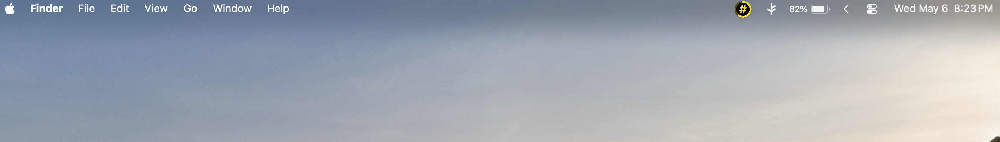
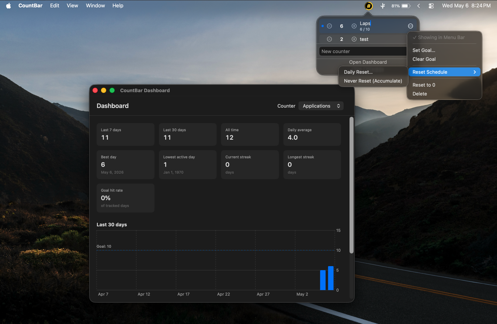
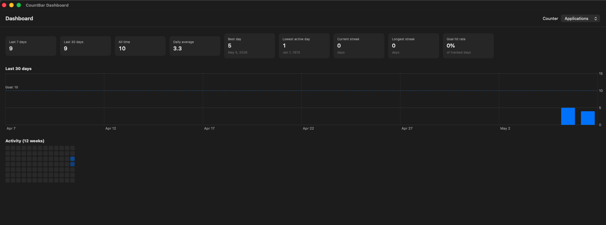

# CountBar

A minimalist tally counter that lives in your macOS menu bar. Click to count, right-click to manage. Track multiple counters with daily reset schedules, set goals, and view your history in a built-in dashboard.

Inspired by [Countly](https://apps.apple.com/hk/app/countly-tally-count-on-menu/id6529533104) — built as a free, open-source alternative.

## Screenshots







## Features

- **One-click counting** — left-click the menu bar icon to increment the active counter
- **Multiple counters** — track pushups, water, tasks, anything; switch which one shows in the menu bar
- **Daily goals** — set a target per counter; the menu bar ring changes color as you progress (red → orange → yellow → blue → green)
- **Per-counter reset schedules** — configure a daily reset time per counter, or set them to never reset (accumulate forever)
- **Inline rename** — double-click any counter name to edit
- **Analytics dashboard** — last 7/30/all-time totals, daily averages, current and longest streaks, goal hit rate, 30-day chart, 12-week activity heatmap
- **Launch at login** — toggle from the popover; CountBar starts with your Mac
- **Adapts to your theme** — follows light/dark mode and your system accent color
- **Privacy-first** — all data stored locally; nothing leaves your machine

## Requirements

- macOS 14.0 (Sonoma) or later

## Install

### Pre-built download

Grab the latest `.app` from the [Releases](../../releases) page, drag it to `/Applications`, and launch.

> **First-launch note:** because CountBar isn't signed by an Apple Developer Program account, macOS Gatekeeper will block the first launch. To bypass it on macOS 15+:
>
> 1. Try to open `CountBar.app` (it'll be blocked with a "Not Opened" dialog) — click **Done**
> 2. Open **System Settings → Privacy & Security** → scroll to the bottom
> 3. Click **Open Anyway** next to the CountBar entry
> 4. Confirm in the dialog that follows
>
> Or, in Terminal:
>
> ```
> xattr -dr com.apple.quarantine /Applications/CountBar.app
> ```
>
> This is a one-time step. After that, CountBar launches normally.

### Build from source

```bash
git clone https://github.com/YOUR_USERNAME/countbar.git
cd countbar
open CountBar.xcodeproj
```

Then in Xcode press ⌘R to run. To install permanently: **Product → Archive → Distribute App → Custom → Copy App**, then drag `CountBar.app` to `/Applications`.

## Usage

| Action                           | How                                           |
| -------------------------------- | --------------------------------------------- |
| Increment active counter         | Left-click the menu bar icon                  |
| Open popover                     | Right-click the menu bar icon                 |
| Add a counter                    | Type in the popover's text field, press Enter |
| Rename a counter                 | Double-click its name                         |
| Set goal / reset schedule        | Click the `…` menu on a counter row           |
| Switch active (menu bar) counter | `…` menu → "Show in Menu Bar"                 |
| Open the dashboard               | "Open Dashboard" in the popover, or ⌘D        |
| Quit                             | "Quit CountBar" in the popover, or ⌘Q         |

The menu bar ring fills as you approach your daily goal, and changes color through five stages: red (under 25%) → orange → yellow → blue → green (goal hit or exceeded).

## Tech

- **SwiftUI + AppKit** — `MenuBarExtra` doesn't allow distinct left/right click handling, so the status item is built on `NSStatusItem` instead. The popover content is pure SwiftUI hosted via `NSHostingController`.
- **SwiftData** — persistence for counters and daily entries
- **Swift Charts** — daily bar chart in the dashboard
- **SF Symbols** — variable-color progress ring on the menu bar icon

## Roadmap

- [ ] Notarized DMG releases (requires Apple Developer Program)
- [ ] Homebrew Cask
- [ ] Optional iCloud sync
- [ ] Per-counter SF Symbol picker
- [ ] Global hotkey for increment
- [ ] Export data as CSV

## Contributing

Issues and PRs welcome. For larger features, open an issue first to discuss.

## License

MIT — see [LICENSE](LICENSE).
